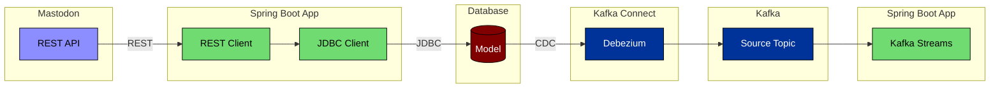

# Apache Kafka CDC Event Stream

This example implements a Change Data Capture (CDC) pipeline with Apache Kafka.

## Architecture

The arrows in the diagram above signify data flow.

Change Data Capture (CDC) is typically used to publish records of data changes in a database.

## Use Cases

